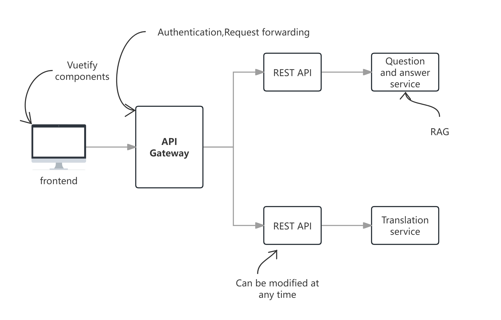

# vuetify+langchain+llama3+Chroma RAG demo

## Overview
This system implements a micro-microservice architecture, and uses vuetify+langchain+local large model+local vector database to build a demonstration of the RAG system.   

It mainly includes the following functions:
- Use local LLM for language translation
- Use local LLM for professional knowledge questions and answers 

 

From the perspective of system architecture, this system consists of three parts: front-end, API gateway, and back-end service:


## Features

<mark>The front end</mark> is developed using `vue3` and `vuetify3`. The script is mainly written using the `Combined API`. The main features include:  
- User authentication based on `OAuth2.0` and `JWT` standards
- Translation component
- Q&A chat component
The front-end code also includes common functions such as `local session management`, `request interception` common modules, `switch theme`, and uses a lot of `veutify3` controls.

<mark>API Gateway</mark> is implemented using `FastAPI`, and mainly implements the following functions:
- User authentication based on `OAuth2.0` and `JWT` specifications
- Request proxy forwarding

<mark>Backend services</mark> mainly provide services based on the local LLM, including:
- Use the `Ollama` platform to deploy and use the `Ollama3.1` open source LLM locally
- Use `Chroma` for local vector data storage and retrieval
- Use `Ollama3.1` or `nomic-embed-text` for vectorization
- Use the local large language model `Ollama3.1` to achieve enhanced generation
- Use `langchian` to integrate the above functions to provide services

## File Structure
- image/ The image directory used in the document
    - src/ The source code directory
        - backend/ The backend code
            - chroma_langchain_db_test_2/ The vectorized data, used by the python file in the current directory
            - data/ The test data, used by the python file in the current directory
            - gateway/ The API gateway
                - common/ The common logic module
                - config/ The configuration file
                - util/ The tool class
                - api gateway with oauth2 authentication based on fastapi.py The gateway startup file
                - start.bat The gateway startup batch file in the windows system, double-click to start the API gateway
            - services/ Application services
                - service consulting/ Consulting services, you can use the start.bat inside to quickly start
                - service translation/ Translation services, you can use the start.bat inside to quickly start
                - response.py API corresponding entity class
            - *.py Python files for practice, there is no mutual reference relationship between files, each file implements a function independently
            - requirements.txt The dependency package of the python runtime environment, calling it with pip can install all the dependency packages of this system at one time
            - start backend.bat Windows batch file, run it to start the gateway and two services
        - webclient/ front-end vuetify code
            - src/ source code directory
            - ...

## Installation

### Backend
2. Install dependencies
After entering the `backend` directory, execute the following command:
```shell
pip install -r requirements.txt
```

1. It is recommended to use `Visual Studio Code` as the development tool, and use `venv` to create a virtual environment in the `backend` folder.
For detailed steps, see: [Configure venv in Visual Studio Code](http://www.wfcoding.com/articles/practice/0101%E5%9C%A8visual-studio-code%E4%B8%AD%E9%85%8D%E7%BD%AEvenv/)
> It is recommended to use `python 3.12.1` or above

1.  Install dependencies
```cmd
pip install -r requirements.txt
```

3. Install `Ollama` and download the large language model to the local computer. Here you need to download `llama3.1` and `nomic-embed-text`  
For detailed steps, please refer to: [Use the locally deployed llama3.1 LLM in langchian](http://www.wfcoding.com/articles/practice/0102%E5%9C%A8langchian%E4%B8%AD%E4%BD%BF%E7%94%A8%E6%9C%AC%E5%9C%B0%E9%83%A8%E7%BD%B2%E7%9A%84llama3%E5%A4%A7%E6%A8%A1%E5%9E%8B/)

4. Start all backend services  
You can use `backend/start backend.bat` to start the gateway and two services with one click. As shown below:  


At this point, the backend service has been configured.

### Front-end

1. It is still recommended to use `Visual Studio Code` to open the project.  
If you are not familiar with using `Visual Studio Code` and `veutify`, it is recommended to take a look at: [Use the fastest way to create a vuetify3 project](http://www.wfcoding.com/articles/practice/0201%E7%94%A8%E6%9C%80%E5%BF%AB%E6%8D%B7%E7%9A%84%E6%96%B9%E6%B3%95%E5%88%9B%E5%BB%BAvuetify3%E9%A1%B9%E7%9B%AE/)
> It is recommended to use `V18.20.5(LTS)`, and it is not recommended to use newer versions.

2. Install node module
```shell
npm install
```

3. Start
```bash
pnpm run dev
```
or
```bash
npm run dev
```

## Additional Notes

If you are not familiar with technologies such as `langchain` and `RAG`, we recommend that you refer to the following introductory tutorials:  
🔗[Building a RAG system of langchain+local large language model+local vector database from scratch](http://www.wfcoding.com/series/%E4%BB%8E%E9%9B%B6%E6%90%AD%E5%BB%BAlangchain+%E6%9C%AC%E5%9C%B0%E5%A4%A7%E6%A8%A1%E5%9E%8B+%E6%9C%AC%E5%9C%B0%E7%9F%A2%E9%87%8F%E6%95%B0%E6%8D%AE%E5%BA%93%E7%9A%84rag%E7%B3%BB%E7%BB%9F/)

If you don't know `vuetify`, you can take a look at the following introductory tutorial:  
🔗[Veutify3 Getting Started](http://www.wfcoding.com/series/veutify3%E5%85%A5%E9%97%A8%E5%AE%9E%E6%88%98/)

---
🪐Good luck🪐
