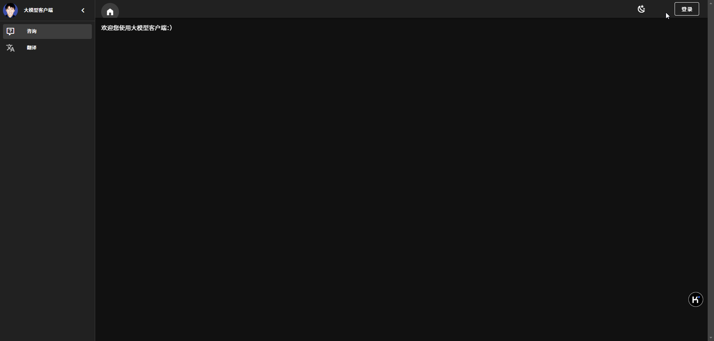
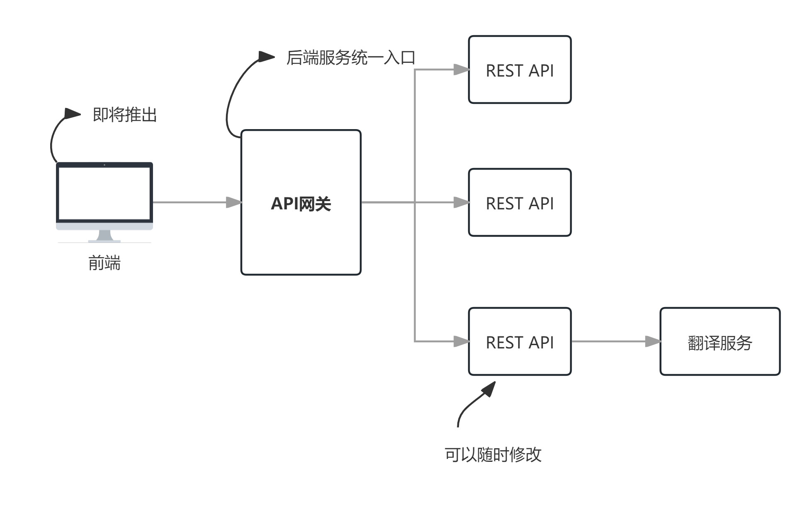
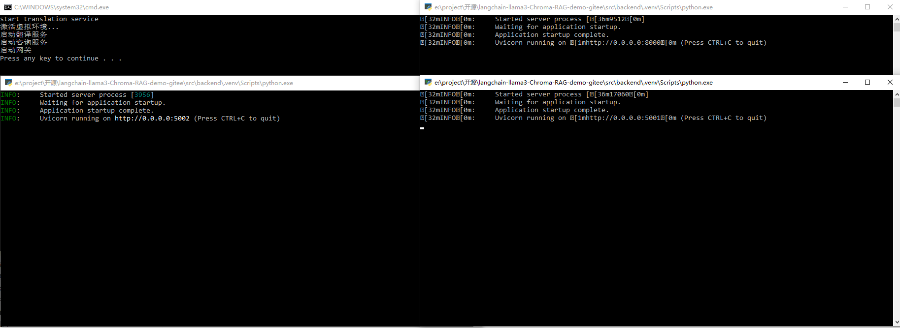

# vuetify+langchain+llama3+Chroma RAG demo

## 概述 
本系统实现了一个微型的微服务架构，并使用vuetify+langchain+本地大语言模型+本地矢量数据库搭建RAG系统的演示。  
它主要包含以下功能：  
- 使用本地大语言模型做语言翻译
- 使用本地大语言模型做专业领域的知识问答



从系统架构来看，本系统包含了前端、API网关、后台服务三大部分：


## 功能
<mark>前端</mark>使用`vue3`和`vuetify3`开发，脚本主要是使用`组合式API`写的，主要功能有：
- 基于`OAuth2.0`和`JWT`标准的用户认证
- 翻译组件
- 问答聊天组件
前端代码还包含了`本地会话管理`、`请求拦截`的通用模块、`切换主题`等常用功能，使用了很多`veutify3`控件。

<mark>API网关</mark>使用`FastAPI`实现，主要实现以下功能：
- 基于`OAuth2.0`和`JWT`规范的用户认证 
- 请求代理转发

<mark>后台服务</mark>主要基于本地大语言模型提供服务，包括：
- 使用`Ollama`平台，在本地部署和使用`Ollama3.1`开源大语言模型
- 使用`Chroma`做本地矢量数据存储和检索
- 使用`Ollama3.1`或者`nomic-embed-text`进行矢量化
- 使用本地大语言模型`Ollama3.1`实现增强生成
- 使用`langchian`将以上功能整合起来提供服务

## 文件结构

- image/ 在文档中使用的图片目录
- src/ 源代码目录
    - backend/  后端代码
        - chroma_langchain_db_test_2/ 矢量化的数据，当前目录的python文件使用
        - data/ 测试数据，当前目录的python文件使用
        - gateway/ API网关
            - common/ 通用逻辑模块
            - config/ 配置文件
            - util/  工具类
            - api gateway with oauth2 authentication based on fastapi.py  网关启动文件
            - start.bat  windows系统中的网关启动批处理文件，双击即可启动API网关
        - services/  应用服务
            - service consulting/  咨询服务，可使用里面的start.bat快速启动
            - service translation/  翻译服务，可使用里面的start.bat快速启动
            - response.py  API相应实体类
        - *.py  练习用的python文件，文件之间没有相互引用关系，每一个文件都独立实现一个功能
        - requirements.txt  python运行环境的依赖包，用pip调用它可以一次性安装所有本系统的依赖包
        - start backend.bat  windows的批处理文件，运行它可启动网关和两个服务
    - webclient/  前端vuetify代码
        - src/  源代码目录
        - ...

## 安装教程

### 后端

1. 建议开发工具使用`Visual Studio Code`，并使用`venv`在`backend`文件夹内创建虚拟环境  
详细步骤参见：[在Visual Studio Code中配置venv](http://www.wfcoding.com/articles/practice/0101%E5%9C%A8visual-studio-code%E4%B8%AD%E9%85%8D%E7%BD%AEvenv/)
> 建议使用 `python 3.12.1`或者以上版本

2. 安装依赖
进入`backend`目录后，执行下面的命令：
```shell
pip install -r requirements.txt
```

3. 安装`Ollama`并下载大模型到本地，这里需要下载`llama3.1`和`nomic-embed-text`    
详细步骤参见：[在langchian中使用本地部署的llama3.1大语言模型](http://www.wfcoding.com/articles/practice/0102%E5%9C%A8langchian%E4%B8%AD%E4%BD%BF%E7%94%A8%E6%9C%AC%E5%9C%B0%E9%83%A8%E7%BD%B2%E7%9A%84llama3%E5%A4%A7%E6%A8%A1%E5%9E%8B/)

4. 启动后端所有服务  
可以使用 `backend/start backend.bat` 一键启动网关和两个服务。如下图：


至此，后端服务就已经装备好了。

### 前端
1. 依然建议使用`Visual Studio Code`，用它打开项目。  
如果您对使用`Visual Studio Code`和`veutify`不熟悉，建议先看看：[用最快捷的方法创建vuetify3项目](http://www.wfcoding.com/articles/practice/0201%E7%94%A8%E6%9C%80%E5%BF%AB%E6%8D%B7%E7%9A%84%E6%96%B9%E6%B3%95%E5%88%9B%E5%BB%BAvuetify3%E9%A1%B9%E7%9B%AE/)
> 建议使用`V18.20.5(LTS)`，不建议用更新的版本。

2. 安装node模块
```shell
npm install
```

3. 启动
```bash
pnpm run dev
```
或者
```bash
npm run dev
```

## 补充说明

如果您对`langchain`、`RAG`这些技术不熟悉，建议您参考下面的入门教程：  
🔗[从零搭建langchain+本地大语言模型+本地矢量数据库的RAG系统](http://www.wfcoding.com/series/%E4%BB%8E%E9%9B%B6%E6%90%AD%E5%BB%BAlangchain+%E6%9C%AC%E5%9C%B0%E5%A4%A7%E6%A8%A1%E5%9E%8B+%E6%9C%AC%E5%9C%B0%E7%9F%A2%E9%87%8F%E6%95%B0%E6%8D%AE%E5%BA%93%E7%9A%84rag%E7%B3%BB%E7%BB%9F/)

如果您不了解`vuetify`，您可以先看看下面的入门教程：  
🔗[Veutify3入门实战](http://www.wfcoding.com/series/veutify3%E5%85%A5%E9%97%A8%E5%AE%9E%E6%88%98/)

---
🪐祝好运🪐